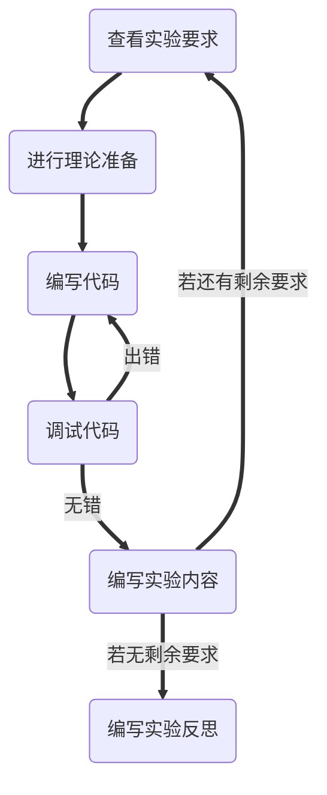
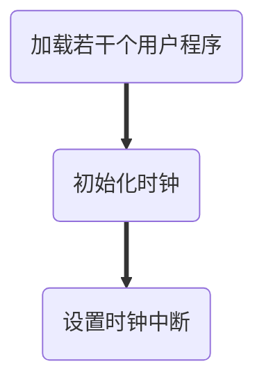

# <center>实验六：实现时间片轮转的二态进程模型</center>
### 一、实验目的：
1. 学习多道程序与CPU分时技术
2. 掌握操作系统内核的二态进程模型设计与实现方法
3. 掌握进程表示方法
4. 掌握时间片轮转调度的实现
### 二、实验要求：
1. 了解操作系统内核的二态进程模型
2. 扩展实验五的的内核程序，增加一条命令可同时创建多个进程分时运行，增加进程控制块和进程表数据结构。
3. 修改时钟中断处理程序，调用时间片轮转调度算法。
4. 设计实现时间片轮转调度算法，每次时钟中断，就切换进程，实现进程轮流运行。
5. 修改save()和restart()两个汇编过程，利用进程控制块保存当前被中断进程的现场，并从进程控制块恢复下一个进程的现场。
6. 编写实验报告，描述实验工作的过程和必要的细节，如截屏或录屏，以证实实验工作的真实性
### 三、技术路线：

### 四、实验原理：
### 五、实验内容：
##### (1) 修改实验5的内核代码，定义进程控制块PCB类型，包括进程号、程序名、进程内存地址信息、CPU寄存器保存区、进程状态等必要数据项，再定义一个PCB数组，最大进程数为10个。
###### 理论准备：
1. 将上次写的在asm中定义的`_register`，重写成C的结构体，方便建立多个结构体以给多进程使用。
2. 为了保持结构体在asm中的可读性，使用`equ`语法，定义一些标签表示偏移。
3. 定义PCB数组时，进程内存地址信息存在寄存器中。如段寄存器，`esp`，`ip`等。因而结构体需要存的成员有`pregs`，`pid`，`pname`，`pstate`。
###### 代码编写：
1. 重写`_register`为结构体`struct reg`。
```C
struct reg
{
    unsigned int ax;
    unsigned int bx;
    unsigned int cx;
    unsigned int dx;
    unsigned int sp;
    unsigned int bp;
    unsigned int si;
    unsigned int di;
    unsigned int ip;
    unsigned int flags;
    unsigned int es;
    unsigned int cs;
    unsigned int ss;
    unsigned int ds;
    unsigned int fs;
    unsigned int gs;
};
struct reg regs;
```
2. `equ`语法定义标签，保持结构体在asm中的可读性。
```x86asm
_ax equ 0
_bx equ 4
_cx equ 8
_dx equ 12
_sp equ 16
_bp equ 20
_si equ 24
_di equ 28
_ip equ 32
_flags equ 36
_es equ 40
_cs equ 44
_ss equ 48
_ds equ 52
_fs equ 56
_gs equ 60
```
3. `struct PCB`的构建。
```C
struct PCB
{
    struct reg pregs;
    int pid;
    char pname[10];
    char pstate;
};
struct PCB pcblist[MaxProcessNo];
```
##### (2) 扩展实验五的的内核程序，增加一条命令可同时执行多个用户程序，内核加载这些程序，创建多个进程，再实现分时运行。
###### 理论准备：
1. 命令的处理过程：

2. 为了能够同时加载多个用户程序，需要将原先的`_callf`分成加载和调用两个过程，另外加载要将加载到的数据段作为一个参数。
###### 代码编写：

##### (3) 修改时钟中断处理程序，保留无敌风火轮显示，而且增加调用进程调度过程。
###### 理论准备：
###### 代码编写：
##### (4) 内核增加进程调度过程：每次调度，将当前进程转入就绪状态，选择下一个进程运行，如此反复轮流运行。
###### 理论准备：
###### 代码编写：
##### (5) 修改save()和restart()两个汇编过程，利用进程控制块保存当前被中断进程的现场，并从进程控制块恢复下一个进程的运行。
###### 理论准备：
###### 代码编写：
##### (6) 实验5的内核其他功能，如果不必要，可暂时取消服务。
###### 理论准备：
###### 代码编写：
### 六、实验亮点：
### 七、实验反思：